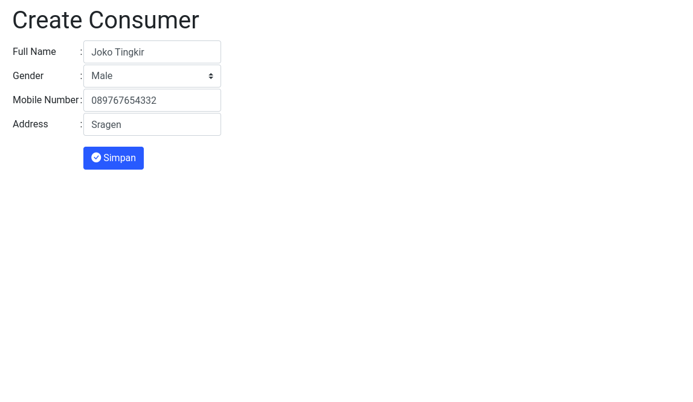

# Tugas PWSS K1 - CRUD Aplikasi Penjualan

<p align="center">
    
</p>

## Introduction

Build a simple php application development environment with docker-compose.


## Requirement
- PHP v8.2.*
- Docker v19.*

## Installation

1. click [Use this template](https://github.com/agprsty-utdi/pwss/generate)
2. git clone & change directory
3. execute the following command

```bash
$ docker compose up -d --build
```
5. run the seeding data dummy
```bash
$ php src/seeder.php
```
6. show application in [http://localhost](http://localhost)
7. show phpmyadmin in [http://localhost:81](http://localhost:81)

## Preview Aplikasi

### Consumer


*Create Consumer*


*List Consumer*


*Update Consumer*

### Product


*Create Product*


*List Product*


*Update Product*

### Order


*Create Order*


*List Order*


*Update Order*